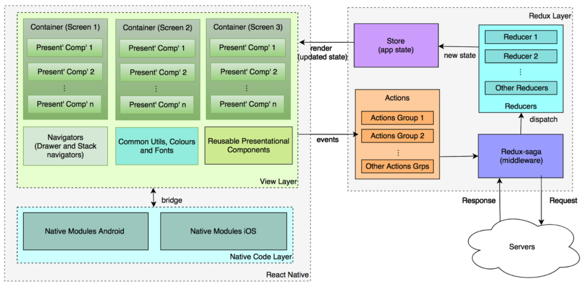

# smart-salah-app
Smart Salah App that can potentially have very smart and innovative features

## Mobile App Architecture ##

## Steps to Run the App ##
1. Install *expo* app in iOS device or Android device (More about expo: [https://expo.io/learn](https://expo.io/learn))
2. Clone the repository
3. Install latest version of *node.js*
4. Install expo cli

        npm install expo-cli --global

5. Change directory to the app root folder

        cd smart-salah-app
    
6. Run the app

        expo start
    
7. Open *expo* in the device
8. Open *smart-salah-app* in the device

## Steps to Install git-flow ##
### Ubuntu ###
1. Run the following command from command-line:

        sudo apt-get install git-flow

## References ##
1. React Native: [https://facebook.github.io/react-native/docs/getting-started](https://facebook.github.io/react-native/docs/getting-started)
2. Redux: [https://redux.js.org/](https://redux.js.org/)
3. Expo: [https://expo.io/learn](https://expo.io/learn)
4. GitFlow Tutorial: [https://www.atlassian.com/git/tutorials/comparing-workflows/gitflow-workflow](https://www.atlassian.com/git/tutorials/comparing-workflows/gitflow-workflow)
5. Mobile App Architecture: [https://www.globallogic.com/gl_news/mobile-application-architecture-react-native-with-redux/](https://www.globallogic.com/gl_news/mobile-application-architecture-react-native-with-redux/)
6. PuTTY and PuTTYGen: [https://www.putty.org/](https://www.putty.org/)
7. Amazon AWS: [https://aws.amazon.com/](https://aws.amazon.com/)
